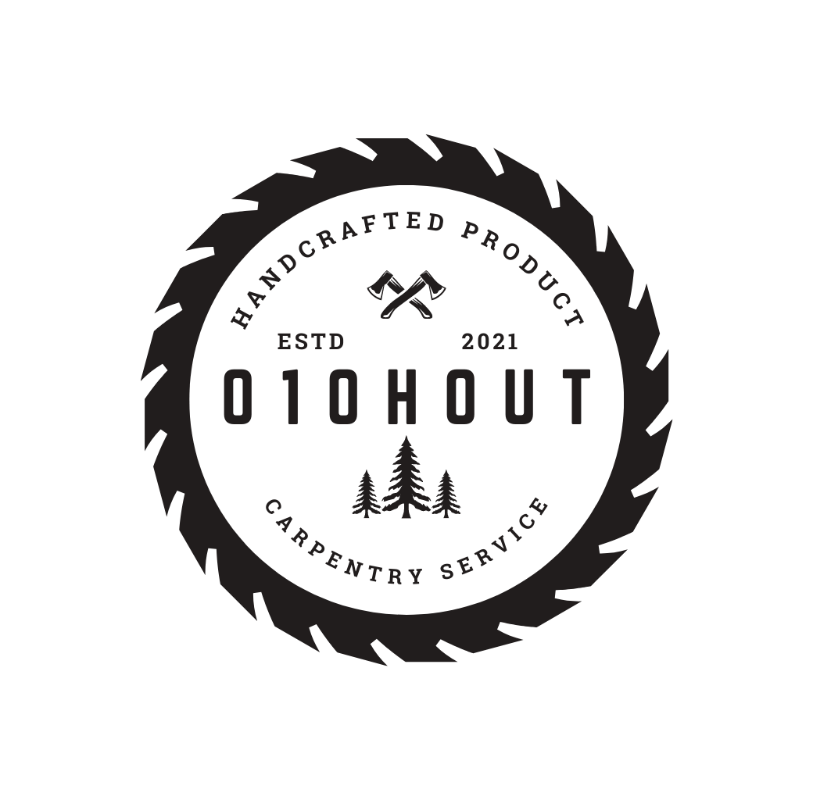

# 010HOUT  

## A Carpentry Service Website

010HOUT is a carpentry service located in Rotterdam - The Netherlands. You can visit the page, get to know their work and contact the company for more information or to pay for their services, which includes: create new wooden furnatures or to provide mainteinence and restoration. 

010HOUT project idea was inspired on the business of a dutch carpenter friend.

The intention of this projected was to test my skills in HTML and CSS, more specifically the use of pseudo-elements.

:warning: Please, open in a computer. The mobile version of this project will be available soon.

  

  

  

## :computer: Gallery view of services provided

  

  

  

  

## Learnings and knowledge consolidation:

>pseudo-elements
>background-image and cover
>mix-blend-mode property

#### Check it live: 010hout.netlify.app

## Projet's Structure

>Conceptual design of the website and project 
>Creation of the logo using Canva.com 
>Designing the website structure using Figma 
>Adding logo, labels and input field in a coherent HTML structure 
>Applying the style to pages, focusing in implement new elements with pseudo-elements 
>Adding button functionality 
>Bringing the website live, using Netlify 
